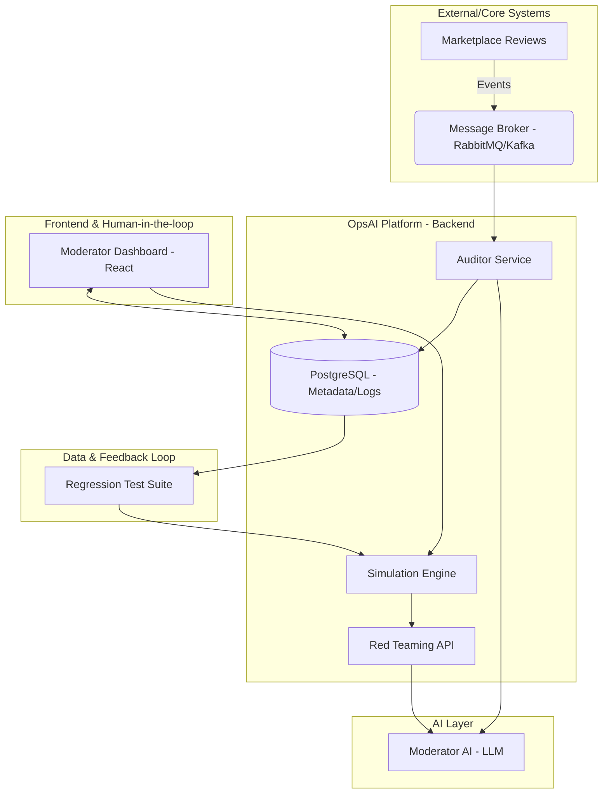

# ShopMinds OpsAI Platform

Plataforma de Operacoes e Observabilidade de IA projetada para escala e eficiencia do time de Trust & Safety no ecossistema Enterprise Application.

## Problema
O crescimento do marketplace gerou dois gargalos criticos na operacao de moderacao:
1. Gargalo de Homologacao (Pre-Deploy): Esforco manual massivo para criar massa de testes de novas regras.
2. Gargalo de Auditoria (Pos-Deploy): Inviabilidade tecnica e financeira de revisar 50k+ decisoes diarias, ocultando erros de falso positivo (ex: elogios bloqueados por erro de contexto).

## Arquitetura do Sistema
A solucao utiliza uma arquitetura orientada a eventos (Event-Driven Design) para garantir desacoplamento total do fluxo principal do marketplace.



## Deep Dive Tecnico: Auditoria e Calibragem (Opcao B)

Para processar 50 mil reviews diariamente com eficiencia de custos, implementamos a Auditoria em Camadas com Shadow Auditing:

1. Filtro de Incerteza (Zona Cinzenta): O Auditor foca na revisao humana de itens com confidence_score entre 0.4 e 0.6.
2. Trava de Seguranca (Shadow Audit): Para mitigar o risco de "Overconfidence Bias" (quando a IA erra com alta confianca), selecionamos aleatoriamente 1% dos casos com score > 0.9 para auditoria. Erros detectados aqui disparam alertas de Model Drift.
3. Clusterizacao por Embeddings: Reviews semelhantes sao agrupados para que o moderador possa revisar padroes (ex: novas girias) de uma so vez.

## Alguns pontos (Handling High Volume)
Caso o volume de incerteza da IA exceda a capacidade operacional humana, a plataforma aplica:

- **Clusterizacao Semantica:** Agrupamento de reviews similares via Embeddings para aprovacao ou bloqueio em lote (Bulk Actions).
- **Impact Prioritization:** Ordenacao da fila de auditoria baseada no volume de vendas do produto e relevancia do usuario.
- **Dynamic Sampling:** Se a "Zona Cinzenta" ultrapassar o limite diario, o sistema seleciona uma amostra estatisticamente relevante para garantir a saude do modelo sem sobrecarregar o time.

## Ciclo Fechado (Feedback Loop)

A plataforma garante a melhoria continua atraves da automacao:

* Promocao Automatica: Toda correcao humana sinalizada como isCorrection no banco de dados e imediatamente inserida na Regression Test Suite.
* Red Teaming: O Simulation Engine utiliza esses erros reais como sementes para gerar variacoes sinteticas, garantindo que o modelo aprenda com as falhas passadas antes do proximo deploy.

## Implementacao Tecnica (PoC)

Utilizamos Prisma ORM e TypeScript para garantir seguranca de tipos e agilidade na modelagem do ciclo de feedback.

```typescript
// Exemplo da logica de Shadow Audit no AuditService.ts
async getReviewsForAuditory() {
  // Casos de incerteza
  const uncertaintyZone = await prisma.moderationDecision.findMany({
    where: { confidenceScore: { gte: 0.4, lte: 0.6 }, audit: null }
  });

  // Trava de seguranca: Amostragem aleatoria de casos com alta confianca
  const shadowAudit = await prisma.$queryRaw`
    SELECT * FROM "ModerationDecision" 
    WHERE "confidenceScore" > 0.9 
    AND id NOT IN (SELECT "decisionId" FROM "Audit")
    ORDER BY RANDOM() LIMIT 50
  `;
  
  return { uncertaintyZone, shadowAudit };
}

```

## Visao de Produto: Metricas de Sucesso

* Time-to-Deploy: Porcentagem de reducao no tempo de homologacao manual.
* Brier Score: Medicao da precisao das probabilidades geradas pela IA (Calibragem).
* Human Efficiency: Taxa de anomalias reais encontradas por hora/homem.

## Stack Tecnologica

* Backend: Node.js (TypeScript) / Fastify.
* ORM: Prisma.
* Database: PostgreSQL e Redis.
* AI: OpenAI API (GPT-4o para auditoria de amostragem).

